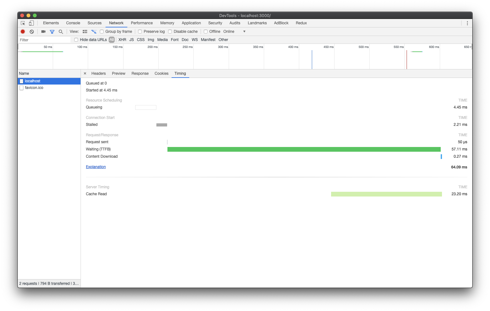
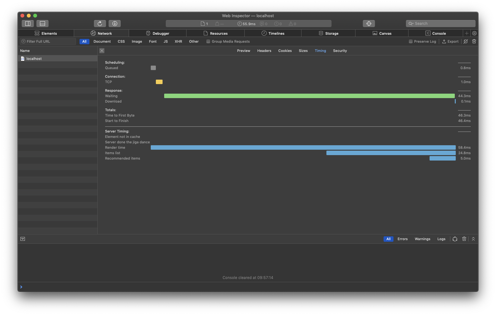
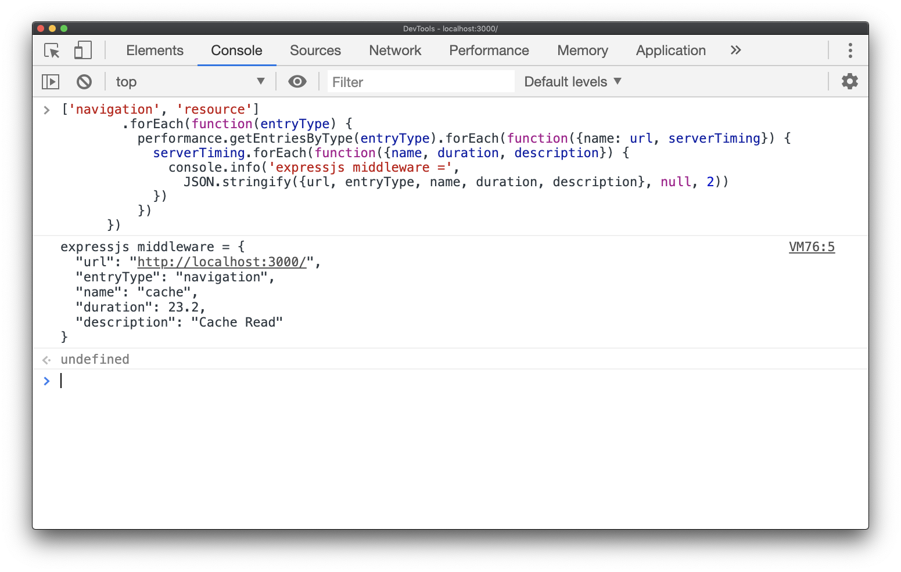

# Abstract

Middleware for express.js to add server timing headers.

## Installation

    npm i -S server-timing-header

## Usage

You may measure time between two points:

```javascript
const express = require('express');
const serverTimingMiddleware = require('server-timing-header');
const port = 3000;
const app = express();
app.use(serverTimingMiddleware({sendHeaders: (process.env.NODE_ENV !== 'production')}));
app.get('/', function (req, res, next) {
  req.serverTiming.from('db');
  // fetching data from database
  req.serverTiming.to('db');
});
app.listen(port, () => console.log(`Example app listening on port ${port}!`));
```

Or just add a metric:

```javascript
const express = require('express');
const serverTimingMiddleware = require('server-timing-header');
const port = 3000;
const app = express();
app.use(serverTimingMiddleware());
app.get('/', function (req, res, next) {
  // You got time metric from the external source
  req.serverTiming.add('cache', 'Cache Read', 23.2);
});
app.listen(port, () => console.log(`Example app listening on port ${port}!`));
```

And see in the Chrome DevTools:

Or Safari DevTools:

Also you may access metrics values from JavaScript on a client:

```javascript
['navigation', 'resource']
        .forEach(function(entryType) {
          performance.getEntriesByType(entryType).forEach(function({name: url, serverTiming}) {
            serverTiming.forEach(function({name, duration, description}) {
              console.info('expressjs middleware =',
                JSON.stringify({url, entryType, name, duration, description}, null, 2))
            })
          })
      })
```



## Support

[Current support:](https://caniuse.com/#feat=server-timing)

+ Chrome v.60
+ FF v.61 _(no dev tools screen)_
+ Safari v.12.1 _(no api support)_

# Documentation

<!-- Generated by documentation.js. Update this documentation by updating the source code. -->

### Table of Contents

-   [ServerTiming](#servertiming)
    -   [addHook](#addhook)
        -   [Parameters](#parameters)
        -   [Examples](#examples)
    -   [removeHook](#removehook)
        -   [Parameters](#parameters-1)
    -   [from](#from)
        -   [Parameters](#parameters-2)
        -   [Examples](#examples-1)
    -   [to](#to)
        -   [Parameters](#parameters-3)
        -   [Examples](#examples-2)
    -   [description](#description)
        -   [Parameters](#parameters-4)
    -   [duration](#duration)
        -   [Parameters](#parameters-5)
    -   [add](#add)
        -   [Parameters](#parameters-6)
        -   [Examples](#examples-3)
    -   [calculateDurationSmart](#calculatedurationsmart)
        -   [Parameters](#parameters-7)
    -   [oldStyle](#oldstyle)
        -   [Parameters](#parameters-8)
    -   [newStyle](#newstyle)
        -   [Parameters](#parameters-9)
-   [index](#index)
    -   [Parameters](#parameters-10)
    -   [Examples](#examples-4)

## ServerTiming

-   **See: <https://w3c.github.io/server-timing/>**

Middleware for express.js to add Server Timing headers

**Meta**

-   **author**: Anton Nemtsev &lt;thesilentimp@gmail.com>

### addHook

Add callback to modify data before create and send headers

#### Parameters

-   `name` **[string](https://developer.mozilla.org/docs/Web/JavaScript/Reference/Global_Objects/String)** — hook name
-   `callback` **[function](https://developer.mozilla.org/docs/Web/JavaScript/Reference/Statements/function)** — function that may modify data before send headers
-   `callbackIndex` **[number](https://developer.mozilla.org/docs/Web/JavaScript/Reference/Global_Objects/Number)** index that will be used to sort callbacks before execution

#### Examples

Add hook to mutate the metrics


```javascript
const express = require('express');
const serverTimingMiddleware = require('server-timing-header');
const port = 3000;
const app = express();
app.use(serverTimingMiddleware());
app.use(function (req, res, next) {
  // If one measurement include other inside you may substract times
  req.serverTiming.addHook('substractDataTimeFromRenderTime', function (metrics) {
     const updated = { ...metrics };
     if (updated.data && updated.render) {
       const renderDuration  = req.serverTiming.calculateDurationSmart(updated.render);
       const dataDuration  = req.serverTiming.calculateDurationSmart(updated.data);
       updated.render.duration = Math.abs(renderDuration - dataDuration);
     }
     return updated;
  });
});
app.listen(port, () => console.log(`Example app listening on port ${port}!`));
```

### removeHook

Remove callback with specific name

#### Parameters

-   `name` **[string](https://developer.mozilla.org/docs/Web/JavaScript/Reference/Global_Objects/String)** — hook name

### from

Set start time for metric

#### Parameters

-   `name` **[string](https://developer.mozilla.org/docs/Web/JavaScript/Reference/Global_Objects/String)** — metric name
-   `description` **[string](https://developer.mozilla.org/docs/Web/JavaScript/Reference/Global_Objects/String)?** — description of the metric

#### Examples

You may define only start time for metric


```javascript
const express = require('express');
const serverTimingMiddleware = require('server-timing-header');
const port = 3000;
const app = express();
app.use(serverTimingMiddleware());
app.get('/', function (req, res, next) {
  // If you define only start time for metric,
  // then as the end time will be used header sent time
  req.serverTiming.from('metric', 'metric description');
  // fetching data from database
});
app.listen(port, () => console.log(`Example app listening on port ${port}!`));
```

### to

Set end time for metric

#### Parameters

-   `name` **[string](https://developer.mozilla.org/docs/Web/JavaScript/Reference/Global_Objects/String)** — metric name
-   `description` **[string](https://developer.mozilla.org/docs/Web/JavaScript/Reference/Global_Objects/String)?** — description of the metric

#### Examples

You may define only end time for metric


```javascript
const express = require('express');
const serverTimingMiddleware = require('server-timing-header');
const port = 3000;
const app = express();
app.use(serverTimingMiddleware());
app.get('/', function (req, res, next) {
  // fetching data from database
  // If you define only end time for metric,
  // then as the start time will be used middleware initialization time
  req.serverTiming.to('metric');
});
app.listen(port, () => console.log(`Example app listening on port ${port}!`));
```

### description

Add description to specific metric

#### Parameters

-   `name` **[string](https://developer.mozilla.org/docs/Web/JavaScript/Reference/Global_Objects/String)** — metric name
-   `description` **[string](https://developer.mozilla.org/docs/Web/JavaScript/Reference/Global_Objects/String)** — description of the metric

### duration

Add duration to specific metric

#### Parameters

-   `name` **[string](https://developer.mozilla.org/docs/Web/JavaScript/Reference/Global_Objects/String)** — metric name
-   `duration` **float** — duration of the metric

### add

Add metric

#### Parameters

-   `name` **[string](https://developer.mozilla.org/docs/Web/JavaScript/Reference/Global_Objects/String)** metric name
-   `description` **[string](https://developer.mozilla.org/docs/Web/JavaScript/Reference/Global_Objects/String)** — metric description
-   `duration` **[number](https://developer.mozilla.org/docs/Web/JavaScript/Reference/Global_Objects/Number)** — metric duration (optional, default `0.0`)

#### Examples

Add metric


```javascript
const express = require('express');
const serverTimingMiddleware = require('server-timing-header');
const port = 3000;
const app = express();
app.use(serverTimingMiddleware());
app.get('/', function (req, res, next) {
  // You got time metric from the external source
  req.serverTiming.add('metric', 'metric description', 52.3);
});
app.listen(port, () => console.log(`Example app listening on port ${port}!`));
```

### calculateDurationSmart

Calculate duration between two timestamps, if from or two is undefined — will use initialization time and current time to replace

#### Parameters

-   `metric` **[object](https://developer.mozilla.org/docs/Web/JavaScript/Reference/Global_Objects/Object)** — object that contain metric information
    -   `metric.name` **[string](https://developer.mozilla.org/docs/Web/JavaScript/Reference/Global_Objects/String)** — metric name
    -   `metric.description` **[string](https://developer.mozilla.org/docs/Web/JavaScript/Reference/Global_Objects/String)** — metric description
    -   `metric.from` **[Array](https://developer.mozilla.org/docs/Web/JavaScript/Reference/Global_Objects/Array)&lt;integer>** — start time [seconds, nanoseconds], if undefined, initialization time will be used
    -   `metric.to` **[Array](https://developer.mozilla.org/docs/Web/JavaScript/Reference/Global_Objects/Array)&lt;integer>** — end time [seconds, nanoseconds], if undefined, current timestamp will be used
    -   `metric.duration` **integer** — time in milliseconds, if not undefined method will just return durations

Returns **integer** duration in milliseconds

### oldStyle

Build server-timing header value by old specification

#### Parameters

-   `name` **[string](https://developer.mozilla.org/docs/Web/JavaScript/Reference/Global_Objects/String)** metric name
-   `description` **[string](https://developer.mozilla.org/docs/Web/JavaScript/Reference/Global_Objects/String)** metric description
-   `duration` **[string](https://developer.mozilla.org/docs/Web/JavaScript/Reference/Global_Objects/String)** metric duration

Returns **[string](https://developer.mozilla.org/docs/Web/JavaScript/Reference/Global_Objects/String)** — server-timing header value

### newStyle

Build server-timing header value by current specification

#### Parameters

-   `name` **[string](https://developer.mozilla.org/docs/Web/JavaScript/Reference/Global_Objects/String)** metric name
-   `description` **[string](https://developer.mozilla.org/docs/Web/JavaScript/Reference/Global_Objects/String)** metric description
-   `duration` **[string](https://developer.mozilla.org/docs/Web/JavaScript/Reference/Global_Objects/String)** metric duration

Returns **[string](https://developer.mozilla.org/docs/Web/JavaScript/Reference/Global_Objects/String)** — server-timing header value

## index

Express middleware add serverTiming to request and
make sure that we will send this headers before express finish request

### Parameters

-   `options` **[object](https://developer.mozilla.org/docs/Web/JavaScript/Reference/Global_Objects/Object)?** — middleware options (optional, default `{}`)
    -   `options.sendHeaders` **[boolean](https://developer.mozilla.org/docs/Web/JavaScript/Reference/Global_Objects/Boolean)?** should middleware send headers (may be disabled for some environments) (optional, default `true`)

### Examples

How to add middleware


```javascript
const express = require('express');
const serverTimingMiddleware = require('server-timing-header');
const port = 3000;
const app = express();
app.use(serverTimingMiddleware());
app.get('/', function (req, res, next) {
  req.serverTiming.from('db');
  // fetching data from database
  req.serverTiming.to('db');
});
app.listen(port, () => console.log(`Example app listening on port ${port}!`));
```

Returns **[function](https://developer.mozilla.org/docs/Web/JavaScript/Reference/Statements/function)** return express middleware
